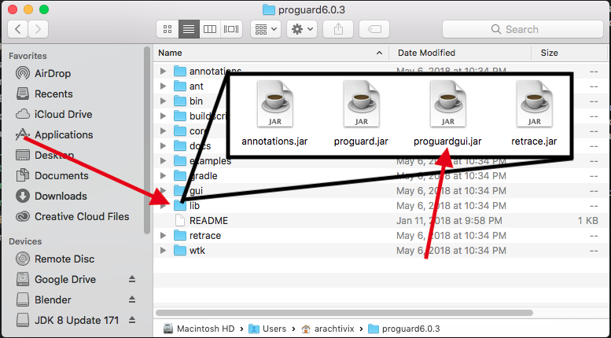
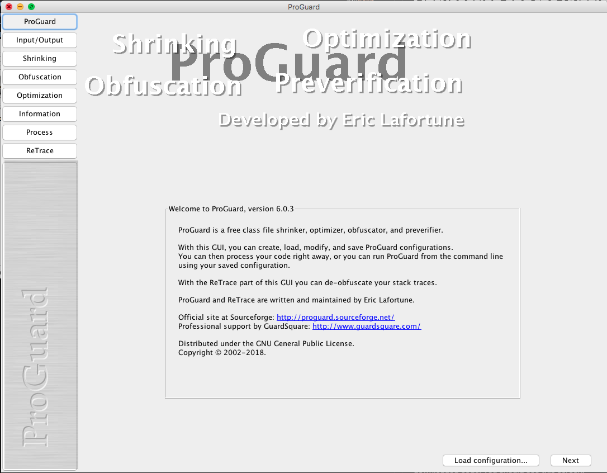

# Obfuscation and the Puzzles of De-obfuscation

Obfuscation is a common part of many build processes, especially in Android builds using ProGuard.  You can use ProGuard with any project generating zipped archives though, and it can be a good idea if you want to discourage abuse of your software.  De-obfuscation can be a daunting task, but sometimes a necessary one for purposes such as digital forensics and the prospect of a challenge for its own sake.  This video will show you the relationship between the everyday tasks a developer does and the process of finding meaning in the intentional mess left behind by a good obfuscator.

I have added the files discussed here to this part of the repository so you can take a look at the results for yourself.

## Running ProGuard Manually

Normally in a professional software project you will see obfuscation performed by the automated release build.  This is more typical for the front end and is an integrated part of Android builds, but for the purposes of learning about ProGuard, it's easier to use the executable jar with a graphical interface.

To start, go to the [project page on SourceForge](https://sourceforge.net/projects/proguard/) and click download. This will give you the latest proguard zip.  Expand this zip to a convenient location:



Open up the 'lib' folder and double click on proguardgui.jar.  After any warnings you may get about executing downloaded code, you should see this screen:




## Decompilation
First, in order to demonstrate that something is actually happening when we run the obfuscator, we should decompile the artifact we had before obfuscation.   I did this here in the __control_out/__ folder, as it represents the control case for our tests.

Now that we have a way to refer back to the unmodified artifact, we can proceed to examine the obfuscated artifact.  Just to show you an interesting hiccup that you will commonly see, let's just attempt to unzip the obfuscated jar:
```bash
Daniels-Mac-mini:test_1_out arachtivix$ unzip 
```
```bash
commons-collections4-4.1_OBFUSCATED.jar 
Archive:  commons-collections4-4.1_OBFUSCATED.jar
  inflating: META-INF/MANIFEST.MF    
  inflating: META-INF/NOTICE.txt     
  inflating: META-INF/LICENSE.txt    
  inflating: org/a/a/a/g/a.class     
  inflating: org/a/a/a/g/b.class     
  inflating: org/a/a/a/g/d.class     
  inflating: org/a/a/a/g/c.class     
  inflating: org/a/a/a/g/e.class     
  inflating: org/a/a/a/g/g.class     
  inflating: org/a/a/a/g/h.class     
  inflating: org/a/a/a/g/f.class     
  inflating: org/a/a/a/f.class       
  inflating: org/a/a/a/ax.class      
  inflating: org/a/a/a/aw.class      
  inflating: org/a/a/a/am.class      
  inflating: org/a/a/a/s.class       
  inflating: org/a/a/a/c.class       
replace org/a/a/a/C.class? [y]es, [n]o, [A]ll, [N]one, [r]ename: 
```

This shows you that the file naming conventions inside a zip folder can differ from the operating system, in my case here OSX.  The obfuscator has created a c.class and a C.class in org/a/a/a/ and the unzip command cannot reproduce this in the native file system.  The same problem manifests itself when you attempt to decompile this artifact without modifiers, which is likely at least one of the reasons that Fernflower does not unzip the source for you when you invoke the tool at the command line.

Thankfully Fernflower has a simple solution, the **-ren**, aka _rename_ argument:

```bash
java -jar ~/fernflower.jar -ren=1 commons-collections4-4.1_OBFUSCATED.jar test_2_out/
```

According to the [Fernflower Github page](https://github.com/JetBrains/intellij-community/tree/master/plugins/java-decompiler/engine), the purpose of this argument is to "rename ambiguous (resp. obfuscated) classes and class elements."  We can see the effect by unzipping the results:

```bash
Daniels-Mac-mini:test_2_out arachtivix$ unzip
```
```bash
commons-collections4-4.1_OBFUSCATED.jar 
Archive:  commons-collections4-4.1_OBFUSCATED.jar
  inflating: META-INF/MANIFEST.MF    
  inflating: META-INF/NOTICE.txt     
  inflating: META-INF/LICENSE.txt    
  inflating: META-INF/maven/org.apache.commons/commons-collections4/pom.xml  
  inflating: META-INF/maven/org.apache.commons/commons-collections4/pom.properties  
  inflating: org/a/a/a/g/class_250.java  
  inflating: org/a/a/a/g/class_252.java  
  inflating: org/a/a/a/g/class_251.java  
  inflating: org/a/a/a/g/class_208.java  
  inflating: org/a/a/a/g/class_254.java  
  inflating: org/a/a/a/g/class_444.java  
  inflating: org/a/a/a/g/class_255.java  
... More files ...
  inflating: org/a/a/a/class_14.java  
  inflating: org/a/a/a/class_413.java  
  inflating: org/a/a/a/class_414.java
```

Fernflower has taken the obfuscated class files and renamed them as it traversed the artifact in a fashion that is friendlier to the OS, so we can unzip the artifact now.  They're still amost completely meaningless, but at least now they can get into the file system.

## De-obfuscation and refactoring tools

So now that we have the code formatted textually once again, we can import it into an IDE and start looking for the information we need.  This is where the creativity can come in.  For instance, a quick way to look for interesting things is to search for string literals.  Generally you're going to find whatever string literals are in a given app are not changed.  I found it's pretty easy to search with a simple regular expression with grep:

```bash
Daniels-Mac-mini:test_1_out arachtivix$ grep -rn '\".*\"' .
```
```bash
Binary file ./commons-collections4-4.1_OBFUSCATED.jar matches
./META-INF/LICENSE.txt:10:      "License" shall mean the terms and conditions for use, reproduction,
... more non-code matches ...
./META-INF/maven/org.apache.commons/commons-collections4/pom.xml:684:                      <arg line="update --set-depth infinity ${dirs}" />
./org/a/a/a/a/class_363.java:312:         return "[]";
./org/a/a/a/a/class_365.java:36:            throw new IllegalArgumentException("Objects of type " + var1.getClass() + " cannot be added to " + "a naturally ordered TreeBag as it does not implement Comparable");
./org/a/a/a/b/class_147.java:19:         throw new IllegalStateException("Iterator getKey() can only be called after next() and before remove()");
... more exception strings ...
./org/a/a/a/b/class_358.java:83:      return this.field_604 != null ? "MapIterator[" + this.method_6() + "=" + this.method_7() + "]" : "MapIterator[]";
./org/a/a/a/b/class_359.java:60:         throw new NoSuchElementException("Map is empty");
./org/a/a/a/b/class_359.java:69:         throw new NoSuchElementException("Map is empty");
./org/a/a/a/b/class_361.java:6:   field_611("key"),
./org/a/a/a/b/class_361.java:8:   field_612("value");
./org/a/a/a/b/class_362.java:118:         throw new NoSuchElementException("Map is empty");
./org/a/a/a/b/class_362.java:127:         throw new NoSuchElementException("Map is empty");
... more matches ...
./org/a/a/a/p/class_319.java:31:         throw new IllegalArgumentException("fromKey > toKey");
./org/a/a/a/p/class_323.java:23:         throw new NullPointerException("delegate");
./org/a/a/a/p/class_332.java:30:         throw new NullPointerException("Trie must not be null");
```

As you can see, there are string literals in various places, but in this example mostly in the exception constructors.  If you're chasing after an odd exception you're getting from a dependency, this can be a great starting point, matching parts of the log out put to the parameters for the exception constructor.  Of course, this is not even close to guaranteed to work, but sometimes you get lucky!

It may also be helpful to see which classes are used the most frequently, as figuring these out first may shed the most light on the others:

```bash
grep -rh import . | sort | uniq -c | sort
```
```
... less frequently used ...
  11 import java.lang.reflect.Array;
  11 import java.util.Collections;
  11 import java.util.HashSet;
  11 import org.a.a.a.class_22;
  11 import org.a.a.a.class_34;
  12 import java.util.ConcurrentModificationException;
  12 import org.a.a.a.class_12;
  13 import org.a.a.a.class_32;
  13 import org.a.a.a.class_427;
  13 import org.a.a.a.f.class_461;
  14 import java.util.HashMap;
  16 import org.a.a.a.n.class_74;
  17 import java.util.AbstractSet;
  20 import org.a.a.a.class_20;
  21 import java.util.SortedMap;
  24 import org.a.a.a.class_29;
  25 import org.a.a.a.class_7;
  33 import java.util.ArrayList;
  33 import java.util.ListIterator;
  37 import java.util.Comparator;
  37 import org.a.a.a.class_4;
  41 import org.a.a.a.class_21;
  43 import java.util.NoSuchElementException;
  45 import org.a.a.a.class_1;
  50 import java.util.List;
  52 import java.io.ObjectOutputStream;
  53 import java.io.ObjectInputStream;
  80 import java.util.Map;
  90 import java.util.Map.Entry;
  97 import java.util.Set;
 101 import java.io.Serializable;
 140 import java.util.Collection;
 207 import java.util.Iterator;
```

Iterator seems very popular, which make senese for Commons Collections, but that's a class provided by the Java runtime.  We are more curious about the ones like __org.a.a.a.class_1__.  If we run the same import check against our control, we will see that this might be _org.apache.commons.collections4.Predicate_ or _org.apache.commons.collections4.Transformer_ or one of the other well used classes in the unobfuscated version:

```
  25 import java.util.ListIterator;
  29 import java.util.ArrayList;
  31 import java.util.NoSuchElementException;
  34 import java.util.Comparator;
  39 import java.util.Map.Entry;
  40 import java.util.List;
  40 import org.apache.commons.collections4.Transformer;
  44 import org.apache.commons.collections4.Predicate;
  52 import java.io.IOException;
  52 import java.io.ObjectInputStream;
  52 import java.io.ObjectOutputStream;
  66 import java.util.Map;
  67 import java.util.Set;
  93 import java.io.Serializable;
  95 import java.util.Collection;
 107 import java.util.Iterator;
```

Or maybe it's not.  Who knows?  You can see the counts don't match up even for the imports on _java.util.Iterator_, so you can see that the characteristics of decompiled code will never be 100% consistent with the characteristics of the actual code.  The point of counting import statements though is to get an idea of which of your essentially nameless classes might be playing a bigger role than others.

Finally, another approach is to look for familiar elements and refactor the decompiled code with more meaningful or guess-based names as you read the code until a bigger picture starts to come together.

You can open up the project in Eclipse, as I demonstrated in the [Fernflower basics video](https://www.youtube.com/watch?v=YiaglbXbTbQ) ([and notes](/fernflower/README.md)).  Using the refactoring tools, you can programmatically rename class_1 to whatever you'd like, across the entire code base.  This in turn may yield insignts into other areas of the code, and so on.